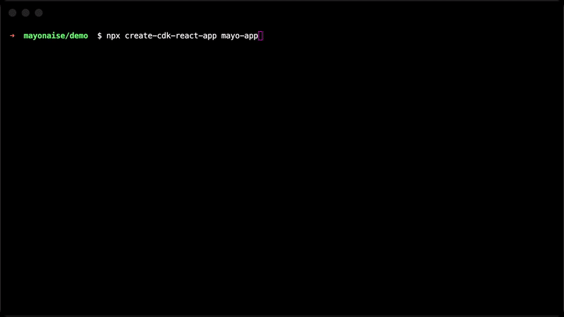

<p align="center">
  
  <p align="center">BUILD MODERN REACT APPS POWERED BY AWS CLOUD </p>  
</p>

---
## Overview

Just do

```sh
npx create-cdk-react-app my-new-app
cd my-new-app
```

Or specify language

```sh
npx create-cdk-react-app my-app --cdk typescript --react typescript
cd my-new-app
```

And you are off to the races into building your modern React web app with AWS backend.

<p align="center">
  
</p>

## Usage

```sh
npx create-cdk-react-app [app-name] [options]
```

### Options

| Option | Required | Description                                                                                                                      |
|-------------------|----------|----------------------------------------------------------------------------------------------------------------------------------|
| `--cdk`           | Optional | Either `javascript` or `typescript`.  <br/> Will initialize the cdk app with the language specified.<br/> Defaults to `javascript`.          |
| `--react`         | Optional | Either `javascript` or `typescript`. <br/> Will initialize the create react app with the language specified. <br/> Defaults to `javascript`. |

---

### License

MIT-0 (see [liecense](./LICENSE))